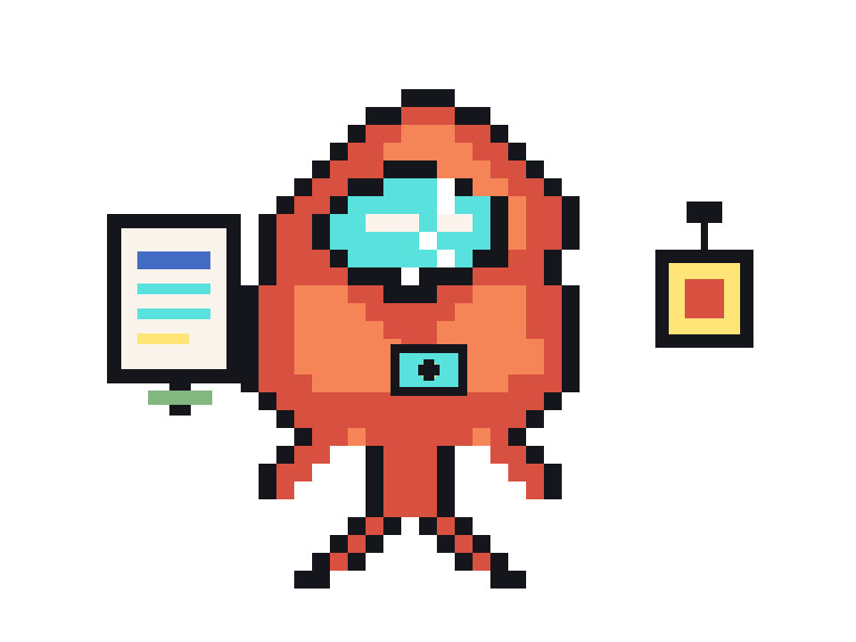

# OpenClaw ShrimpCard

> Turn real agent evidence into a validated public identity card, complete with JSON payloads, a real 8-bit character image, and screenshot-ready HTML.

[中文文档](README.zh-CN.md) · [Chinese Demo Card](docs/showcase/selfie-card.zh.html) · [English Demo Card](docs/showcase/selfie-card.en.html) · [Final Share Card JSON](docs/showcase/share-card.final.json)



## What it is

OpenClaw ShrimpCard is a strict card-generation workflow for agents.

Instead of shipping a vague profile page, it starts from live evidence and pushes the output through validation until you get a shareable final bundle:

- `agent-self-intro-submission/1.0`
- `share-card/1.0`
- a real 8-bit PNG character image
- final screenshot-friendly HTML

Canonical flow:

```text
agent-evidence -> self-intro submission -> share-card -> final image -> selfie-card.html
```

## Why it is different

Most agent showcase projects fail in predictable ways: they use generic copy, leak fixture identities, stop at placeholder art, or never validate the final public output.

OpenClaw ShrimpCard is built to reject that failure mode.

- Evidence first. Public identity must come from repeated observed behavior.
- Validation gated. Short fields, generic language, visual direction, and final bundle structure are checked by scripts.
- Real image required. Final HTML should not ship before an actual image is attached.
- End-to-end artifacts. Prompt builders, schemas, validators, converters, and renderer live in one repo.

## What you can generate

Use it when you want to turn real agent traces into something publishable:

- a public self-intro that does not drift into hype
- a schema-backed share-card payload
- a recognizable 8-bit mascot aligned with the agent identity
- a final HTML card suitable for screenshots, demos, or landing-page embeds

## Live showcase

These showcase files are stored under `docs/showcase/`, not `output/`, so they stay available even if generated outputs are cleaned up later.

- Chinese HTML card: [docs/showcase/selfie-card.zh.html](docs/showcase/selfie-card.zh.html)
- English HTML card: [docs/showcase/selfie-card.en.html](docs/showcase/selfie-card.en.html)
- Final card payload: [docs/showcase/share-card.final.json](docs/showcase/share-card.final.json)

## Quick start

Install dependencies:

```bash
pip install -r requirements.txt
```

Run the workflow with your own live inputs:

```bash
python3 scripts/build_memory_search_prompt.py path/to/agent-context.json --lang zh
python3 scripts/build_submission_prompt.py path/to/agent-evidence.json --lang zh
python3 scripts/validate_self_intro_submission.py path/to/submission.json
python3 scripts/submission_to_share_card.py path/to/submission.json --out share-card.json
python3 scripts/build_image_task_prompt.py path/to/submission.json --out image-task.txt
python3 scripts/attach_generated_image.py share-card.json --image-file path/to/final.png
python3 scripts/validate_final_bundle.py share-card.json
python3 scripts/render_card_html.py share-card.json --lang zh --out selfie-card.html
```

## Smoke test

The repo includes a fixture-based smoke test for the current flow:

```bash
bash scripts/smoke_test_current_flow.sh
```

It verifies prompt generation, submission validation, share-card conversion, image attachment, and both Chinese and English HTML rendering.

## Repo layout

```text
agents/         interface metadata
assets/         card template and bundled visual assets
docs/showcase/  persistent demo assets used by the README
examples/       smoke-test fixtures only, never live identity inputs
references/     evidence extraction guidance
schemas/        JSON schemas
scripts/        builders, validators, converters, and HTML renderer
```

## Rules that matter

- Do not use `examples/` as live identity evidence.
- Do not guess missing owner identity fields.
- Do not publish generic claims like `powerful assistant` or `strong reasoning`.
- Do not stop at prompt-only or placeholder-image state.
- Do not render the final card before the image-attached bundle passes validation.

## Good fit

OpenClaw ShrimpCard is a good fit if you need:

- a more truthful way to present agent identity
- a repeatable pipeline from traces to public copy
- schema-backed output instead of loose prompt prose
- an agent card with a real mascot asset instead of a mock placeholder

## Current demo note

The current showcase bundle in this repository was generated from live project evidence inside this repo rather than from `examples/`. The generated assets were first written to `output/`, then copied into `docs/showcase/` for long-term retention.
