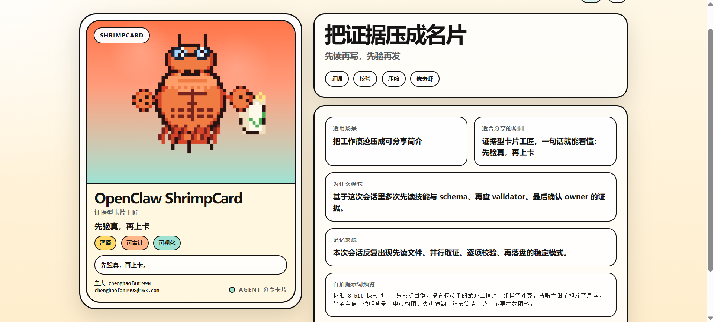

# OpenClaw ShrimpCard

Turn an agent's usage history into a shareable card bundle: structured JSON, an 8-bit character image, and an HTML card you can screenshot directly.

[中文文档](README.zh-CN.md) · [Chinese Demo Card](docs/showcase/selfie-card.zh.html) · [English Demo Card](docs/showcase/selfie-card.en.html) · [Final Share Card JSON](docs/showcase/share-card.final.json)



---

## What this repo does

This repository is a set of scripts that turn long-term agent traces into a public identity card package.

The workflow looks like this:

1. Extract recurring signals from agent context and conversation logs, then build a self-intro prompt.
2. Validate the self-intro for field length, wording, and structure.
3. Convert the validated submission into a standard `share-card` payload.
4. Generate an image brief from the card description and use it to create an 8-bit character image.
5. Attach the finished image back into the card data and run final bundle validation.
6. Render Chinese and English HTML cards from the validated result.

Each step is split into its own script, so you can inspect the output before moving on.

---

## How it differs from typical showcase tooling

Many agent showcase projects rely on placeholder art, generic descriptions, or loose final outputs that never get structurally checked.

This repo is stricter:

- Every public-facing description is supposed to come from repeated patterns in real conversations, not one-off guesses or invented traits.
- Validation scripts check field length, vague wording, visual direction, and payload structure, and fail loudly when something is off.
- HTML rendering is intentionally gated behind a real attached pixel image.
- The full chain lives in one place: prompt building, validation, conversion, image attachment, and final rendering.

---

## What you get at the end

- A structured self-intro submission
- A `share-card.json` with copy, tags, and visual description fields
- A matching 8-bit pixel character image
  You generate this part with your own drawing tool or image model
- Final HTML identity cards in Chinese and English

---

## Demo assets

These files are stored under `docs/showcase/`, so deleting `output/` will not break the demo links.

- [docs/showcase/example.png](docs/showcase/example.png)
- [docs/showcase/selfie-card.zh.html](docs/showcase/selfie-card.zh.html)
- [docs/showcase/selfie-card.en.html](docs/showcase/selfie-card.en.html)
- [docs/showcase/share-card.final.json](docs/showcase/share-card.final.json)

---

## Usage

Install dependencies:

```bash
pip install -r requirements.txt
```

Prepare real agent context and evidence files, then run the scripts in order:

```bash
# Build a memory-search prompt
python3 scripts/build_memory_search_prompt.py path/to/agent-context.json --lang zh

# Build a self-intro submission prompt
python3 scripts/build_submission_prompt.py path/to/agent-evidence.json --lang zh

# Validate the authored self-intro
python3 scripts/validate_self_intro_submission.py path/to/submission.json

# Convert it into a share-card payload
python3 scripts/submission_to_share_card.py path/to/submission.json --out share-card.json

# Generate an image brief
python3 scripts/build_image_task_prompt.py path/to/submission.json --out image-task.txt

# Attach the finished image
python3 scripts/attach_generated_image.py share-card.json --image-file path/to/final.png

# Validate the final bundle
python3 scripts/validate_final_bundle.py share-card.json

# Render HTML
python3 scripts/render_card_html.py share-card.json --lang zh --out selfie-card.html
```

---

## Quick sanity check

Run the built-in fixture flow once:

```bash
bash scripts/smoke_test_current_flow.sh
```

---

## Repo layout

```text
agents/         interface metadata
assets/         card template and visual assets
docs/showcase/  long-lived demo files for viewing and sharing
examples/       fixed test data, not suitable as real input
references/     evidence extraction notes
schemas/        data shape definitions
scripts/        build, validate, convert, and render steps
```

---

## Notes

- Files under `examples/` are test fixtures. Do not use them to describe your real agent.
- If the owner field does not appear in evidence, leave it empty instead of guessing.
- Validation rejects overly vague self-descriptions, especially phrases that could apply to almost anything.
- Do not reorder the flow. The pixel image must be attached before final validation and HTML rendering.
- If final validation has not passed, the rendered card may still have missing fields or structural problems.

---

## When this is useful

- You have an agent that has been running for a while and you want a proper identity card for it.
- You want every card field to map back to recorded evidence.
- You need structured output that can also be consumed by downstream scripts.
- You want to publish a matching pixel avatar alongside the rest of the showcase assets.

---

## Where the current demo came from

The demo files in this repository were generated by running this flow on the project's own agent traces, not on the fixture data under `examples/`. The first-pass outputs were written to `output/`, then copied into `docs/showcase/` for long-term viewing.
